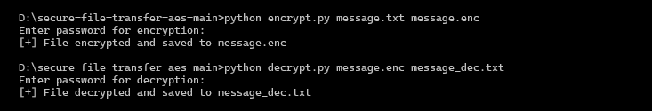
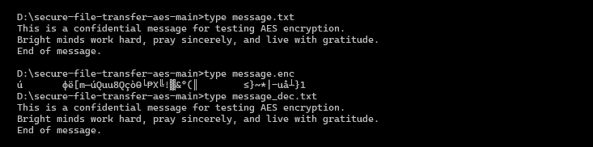

# 🔐 Secure File Transfer with AES-256 Encryption (CBC Mode)

## 📌 Project Overview
This project implements a simple file encryption and decryption system using the **AES-256 (CBC mode)** algorithm.  
The purpose is to demonstrate fundamental concepts of **cryptography** and **secure communication** in Python.

The tool allows:
- Encrypting a file with AES before sending it.
- Decrypting the file back to its original content on the receiver side.

⚠️ **Disclaimer**: This project is for **educational purposes only**.  
Do not use it in production environments.

---

## ✨ Key Features
- AES-256 encryption (32-byte / 256-bit key length) with CBC mode
- PKCS7 padding
- Random IV (Initialization Vector) generated for each encryption (16 bytes = 128 bits)
- Command-line interface (CLI)
- Separate scripts for encryption (`encrypt.py`) and decryption (`decrypt.py`)

---

## 🛠 Skills Demonstrated
- Applied cryptography using Python
- Understanding of AES block cipher, CBC mode, and PKCS7 padding
- Secure key and IV management
- File handling in Python

---

## 📦 Requirements
- Python 3.x
- `cryptography` library

Install dependencies:

```bash
pip install -r requirements.txt
```

---

## 🚀 Usage

### 1. Encrypt a file
```bash
python encrypt.py input.txt encrypted.bin key.bin
```

### 2. Decrypt a file
```bash
python decrypt.py encrypted.bin decrypted.txt key.bin
```

---

## 📂 Example Workflow

We will use a sample file `message.txt`.

### Step 1: Encrypt
```bash
python encrypt.py message.txt message.enc key.bin
```

Output:
```
[+] New AES key generated and saved to key.bin
[+] File encrypted and saved to message.enc
```

### Step 2: Decrypt
```bash
python decrypt.py message.enc message_dec.txt key.bin
```

Output:
```
[+] File decrypted and saved to message_dec.txt
```

Now, open `message_dec.txt` and you will see the original content:
```
This is a confidential message for testing AES encryption.
The quick brown fox jumps over the lazy dog.
End of message.
```

---

## 📸 Demo (Screenshots)

**1. Terminal Output**  


**2. File Content Comparison**  


---

## 🔮 Future Improvements
- Add password-based key derivation (PBKDF2) instead of raw key storage  
- Implement secure key exchange mechanism  
- Build GUI version for easier interaction  

---
